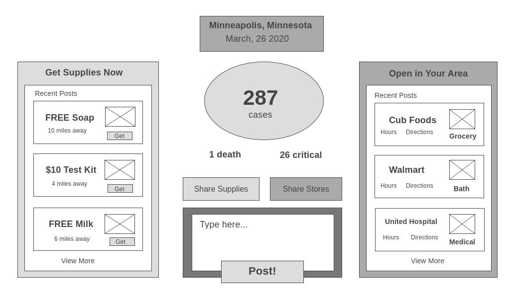

# covid-19

Home page: (https://covid19-application.herokuapp.com/)

The world as we know it is changing and daily life is being altered. Ever since February 2020 chaos has erupted because of the Covid-19 Pandemic.

This application will provide the user with real-time data on how the coronavirus is affecting certain locations, and a place to find and post updates on resources in the area. Want to know which stores are open? Do you have extra soup to share with a neighbor in need? Please share this information on the website and post it to the comments.

This project uses handlebars, ORM structure with routes using get and post, a MySQL database, Travis CI for testing and improvements, a coronavirus API, and a server using node and express.

The project is created in three iterations, with the following iterations including the following information:

Here are the three iterations:

1.  A functioning server with structure and posting basic comments to the browser through a single forum.

2.  API data included into the browser for recent coronavirus statistics based off of the location and the date. Location is "Minneapolis" by default for this project, and current date is displayed to the page.

3.  Two sections of posting comments (right and lefthand sides) with two choices to select from. Most recent comments are shown and can be clicked on. All comments are organized by location.
