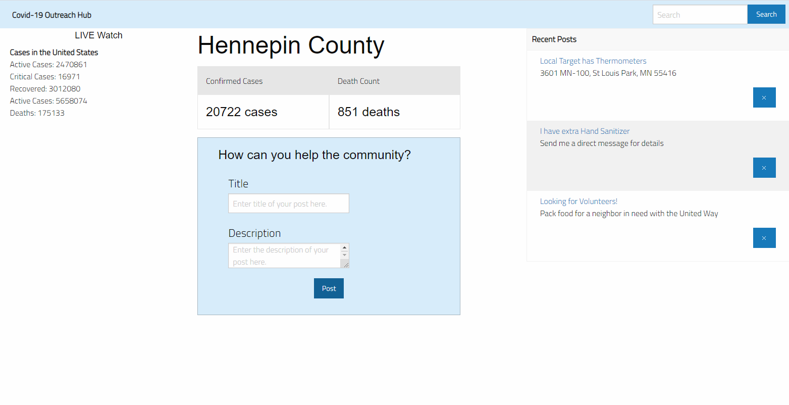

# covid-19

Home page: https://covid19-application.herokuapp.com/

The world as we know it is changing and daily life is being altered. Ever since February 2020 chaos has erupted because of the Covid-19 Pandemic.

This application provides the user with real-time data on Coronavirus statistics for Minneapolis, Minnesota. Future iterations wil include data for nataional and international statistics. 

The application also provides users with an opportunity to help others or seek help via posting: Want to know which stores are open? Do you have an item to lend to a neighbor in need? Posts can help the users find the information they need specific to their area, provided by reliable users in the post section.

This project uses handlebars, ORM structure with routes using get and post, a MySQL database, Travis CI for testing and improvements, a John Hopkins University API for Covid-19 statistics, and a server using node and Express. The front-end uses Materialize for styling. The application is deployed to Heroku, using JawsDB for data storage: https://covid19-application.herokuapp.com/

